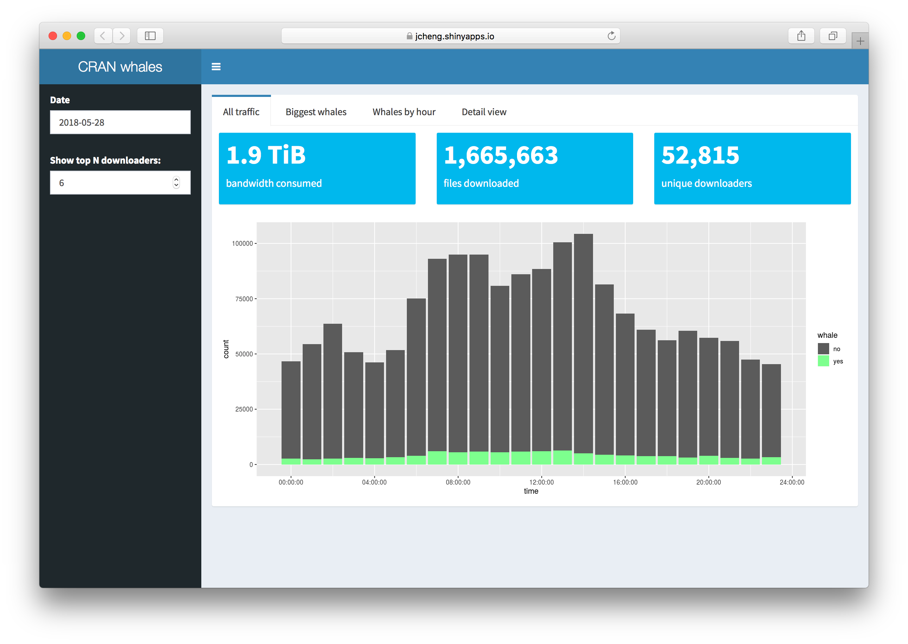
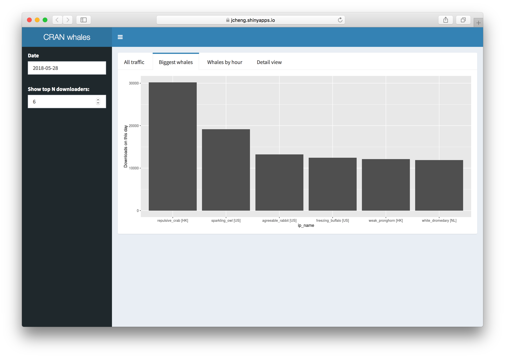
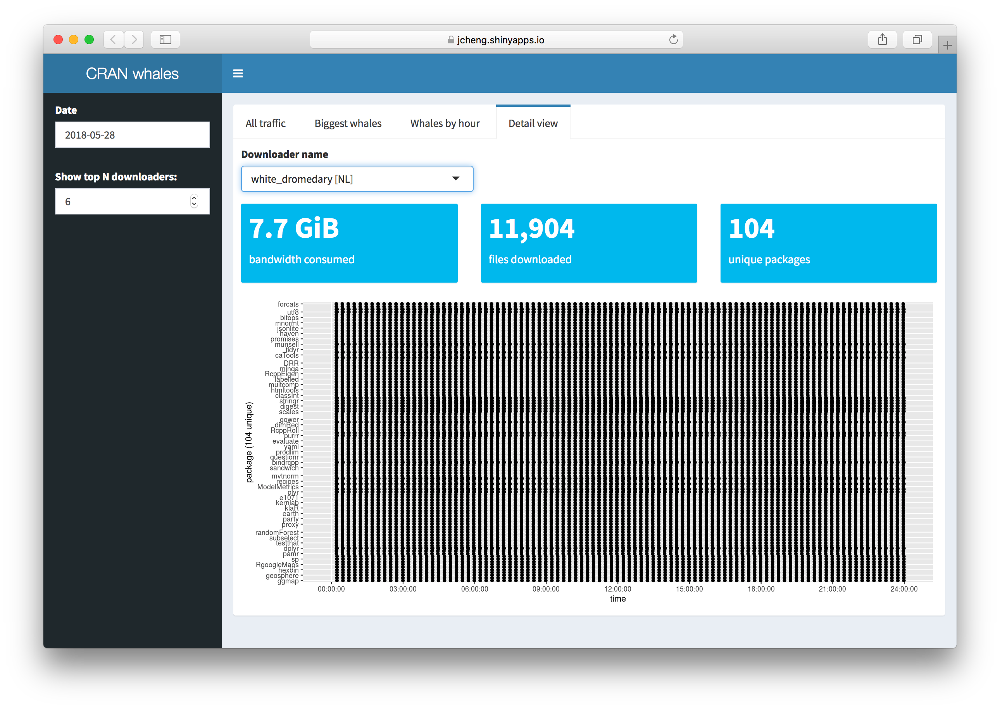

# cranwhales

This is a Shiny example application, meant to demonstrate how to convert synchronous (traditional) Shiny apps to asynchronous ones.

This is the optimized **asynchronous** version. The synchronous version is [here](https://github.com/jcheng5/cranwhales) ([diff](https://github.com/jcheng5/cranwhales/compare/sync...async?diff=split)). The (naive) asynchronous version is [here](https://github.com/rstudio/cranwhales/tree/async) ([diff](https://github.com/jcheng5/cranwhales/compare/async...async2?diff=split)).

To learn more about asynchronous programming in R and Shiny, see https://rstudio.github.io/promises/.

## Installation

To run the app yourself, you'll need Shiny v1.1 or later. If you have an older version or aren't sure, you can install Shiny from CRAN:

```r
install.packages("shiny")
```

You'll also need a number of other packages from CRAN:

```r
install.packages(c("readr", "dplyr", "ggplot2", "DT", "glue", "lubridate", "gdata", "shinydashboard", "future"))
```

Now you're ready to run this app by calling `shiny::runApp()`.

## About the app

This application lets you view the downloads from RStudio's CRAN mirrors on any given day. It lets you specifically focus on the top downloaders ("whales"), who download tens of thousands of packages, usually with pretty curious access patterns.

Start by choosing a date and number of top downloaders to examine (or accept the defaults), then explore the tabs:

### All traffic



Shows download count per hour, and highlights the traffic that came from the top N downloaders.

### Biggest whales



Shows the top downloaders (with randomly assigned names in place of IP addresses), and their number of downloads for the day.

### Whales by hour


Shows each whale's download count per hour of this day.

### Detail view



See a specific whale's download patterns for the day, by looking at what packages they were downloading when. You can click and drag on the plot to view data points in detail, in a table view down below.

---

### License

This application's code is offered to you under [CC0](https://creativecommons.org/publicdomain/zero/1.0/) (i.e. public domain, "no rights reserved").

### Acknowledgements

CRAN log data is from http://cran-logs.rstudio.com/

`animals.txt` was derived from https://www.randomlists.com/random-animals

`adjectives.txt` was derived from http://www.gingersoftware.com/content/grammar-rules/adjectives/lists-of-adjectives/
